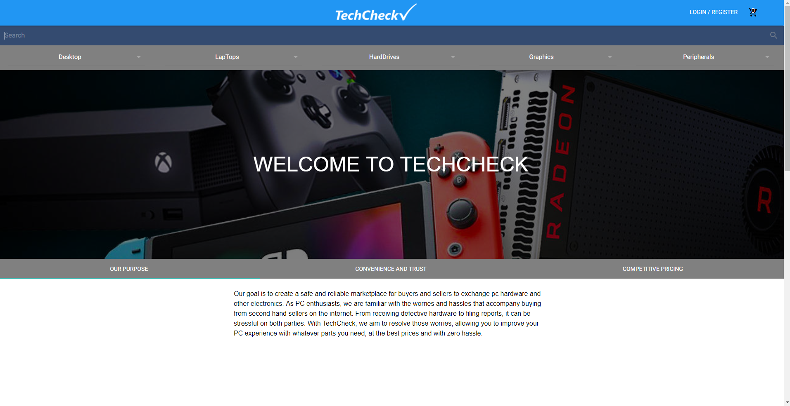

# TechCheck




Techcheck is a medium where users can sell and buy used electronics at a good price.

User posts product information online / send posted product to TECHCHECK

Once received our team of engineers will run thorough diagnostics on the product to assure quality products for the end-user. 


## Getting Started
Following instructions will get you a copy of the project up and running on your local machine for development and testing purposes.

### Prerequisites
[Node.js](http://www.nodejs.org) | [MySQL](http://www.mysql.com) | [React.js](http://www.reactjs.org)

### Installing 
1. SET UP SQL DATABASE
- You will need [MySQL](http://www.mysql.com) installed, please visit link to download s/w. 
- Create `.env.local` file (project root) to store information needed for connection with SQL database.

```
DB_HOST=127.0.0.1
DB_USERNAME=root
DB_PASSWORD=ChangeMe123
DB_SCHEMA=example_db
DB_DIALECT=mysql
```
2. Install dependencies by running `npm install` or `yarn`. 
- After installation, run `npm run watch` or `yarn watch`, depending on package manager being used.  

3. SET  UP SENDGRID.JS 
- Go to [Sendgrid](http://www.sendgrid.com) and create an account. 
- Create an API KEY and create a file using code below.

```
const sendgridkey = 'paste code here '
export default sendgridkey;
```
4. JWTSECRET FILE 
- Create a file name it `jwtSecret.js`, this is needed for JSON Web Token  
- Make up any string that is secure as shown below. 

```
const jwtSecret ='make up any string'
export default jwtSecret;
```

5. SET UP AWS (Amazon Web Services)
- Go to [AWS](http://www.aws.amazon.com) and create an account
- AWS will provide a `key` and `secret` 
- Create TWO files `awskey.js` and `awssecret` using the examples shown below.

#### awskey.js
```
const s3key='paste key here'
export default s3key;
```

#### awssecret.js
```
const secret = 'paste secret code'
export default secret;
```


## Built With
[React.js](http://www.reactjs.org) |
[Node.js](http://www.nodejs.org) |
[Express](http://www.expressjs.com) |
[Sequelize](http://docs.sequelizejs.com/) |
[Material-ui](https://www.material-ui.com/#/) |
[MySQL](http://www.mysql.com) |
[AWS](http://www.aws.amazon.com) |
[Sendgrid](http://www.sendgrid.com)

## Authors
- David Horn-[hornd24](http://www.github.com/hornd24) (Back-end)
- Daniel Oh-[danniboi82](http://www.github.com/danniboi82) (Front-end)
- Andrew Nguyen-[weboshi](http://www.github.com/weboshi) (Back-end)
- Padma Ramani-[Padmaramani](http://www.github.com/Padmaramani) (Back-end)
- Kevin Lee-[timpaniman](http://www.github.com/timpaniman) (Front-end)


License
This project is licensed under the MIT License - see the LICENSE.md file for details
